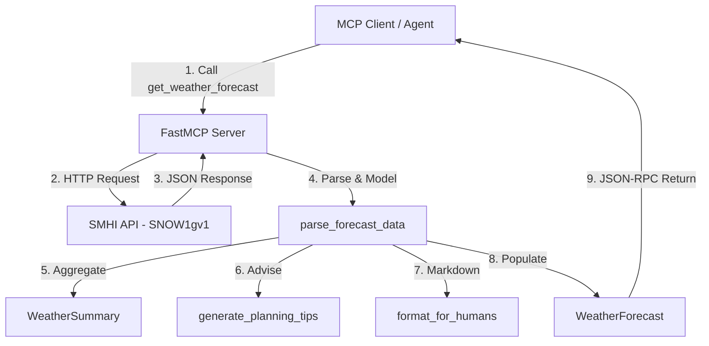

# AI Agent Developer Guide: SMHI Weather Forecast MCP Server

Welcome! This document is designed for AI coding agents to understand the repository structure, code design, development workflows, and critical runtime constraints of the **SMHI Weather Forecast MCP Server**.

---

## 📌 Repository Overview

This repository implements a Model Context Protocol (MCP) server that provides weather forecasts from **SMHI (Sveriges Meteorologiska och Hydrologiska Institut)** for planning activities in Sweden.

The primary entry point is [server.py](file:///home/olive/ai/smhi-mcp/server.py), which uses the [FastMCP](https://github.com/jlowin/fastmcp) framework to expose a single MCP tool called `get_weather_forecast`.

### File Map

- **[server.py](file:///home/olive/ai/smhi-mcp/server.py)**: Contains the MCP server instance, tool definitions, API integration, data models, parser logic, and human-readable text generation.
- **[pyproject.toml](file:///home/olive/ai/smhi-mcp/pyproject.toml)**: Defines project metadata, dependencies (FastMCP, httpx, pydantic, loguru, tzdata), and tool configurations (ruff, pytest).
- **[tests/test_parse_forecast.py](file:///home/olive/ai/smhi-mcp/tests/test_parse_forecast.py)**: Unit tests for checking forecast parser logic against mock responses.
- **`tests/fixtures/snow1_point_sample.json`**: Mock JSON response from the SMHI SNOW1 API used in tests.
- **[README.md](file:///home/olive/ai/smhi-mcp/README.md)**: User-facing documentation and installation guide.
- **[CHANGELOG.md](file:///home/olive/ai/smhi-mcp/CHANGELOG.md)**: Release log tracking updates (e.g., migration to the SNOW1 API).

---

## ⚠️ Critical Development Constraints

If you are modifying or debugging this repository, you **MUST** adhere to the following rules:

> [important]
> **DO NOT Write to Standard Output (`stdout`)**
> MCP servers running over stdio use `stdout` and `stdin` exclusively for JSON-RPC messages. Any raw prints, uncaught warning outputs, or default console logger logs written to `stdout` **will corrupt the protocol and crash the connection**.
> - Never use `print()` or `sys.stdout.write()`.
> - The server uses `loguru` configured to disable standard console output (`logger.remove()`) and redirect all log messages to `logs/smhi_weather_mcp.log` and `logs/smhi_weather_mcp_debug.log`. Do not alter this configuration.

> [warning]
> **Geographic Restrictions (Sweden Only)**
> The SMHI forecast API only returns data for the Scandinavian/Sweden region. Coordinates outside this region will result in API failures or invalid outputs.
> - **Latitude bounds**: `55.0` to `70.0`
> - **Longitude bounds**: `10.0` to `25.0`
> - Input validation checks in [get_weather_forecast](file:///home/olive/ai/smhi-mcp/server.py#L181) enforce these bounds.

> [note]
> **Timezone Rules (Stockholm Local Time)**
> - All datetime inputs and outputs must be processed/displayed in Stockholm local time (`Europe/Stockholm` timezone).
> - Use standard Python `zoneinfo` module with the IANA zone name `Europe/Stockholm`.
> - Do not expose raw UTC timestamps to the final user interface.

---

## 🛠️ Tech Stack & Dependencies

The project relies on a modern Python stack managed with `uv`:
- **Python**: `>=3.11` (currently tested up to `3.14`)
- **FastMCP**: Fast wrapper for Model Context Protocol servers.
- **HTTPX**: Async HTTP client used for fetching SMHI data.
- **Pydantic v2**: Structured models and data validation.
- **Loguru**: Structured file logging.
- **Tzdata**: Timezone database support (required on Windows platforms).
- **Pytest**: Test suite framework.
- **Ruff**: Linting and formatting.

---

## 🧱 Architecture & Data Flow



### 1. Data Models
Weather responses are structured using Pydantic:
- **[HourlyForecast](file:///home/olive/ai/smhi-mcp/server.py#L124)**: Represents weather conditions for a single hour. Contains 14 parameters including temperature, wind speed/direction/gusts, humidity, cloud cover, visibility, pressure, and decoded weather symbols.
- **[WeatherSummary](file:///home/olive/ai/smhi-mcp/server.py#L149)**: Aggregated weather metrics (min/max temp, precipitation flags, average/max wind).
- **[WeatherForecast](file:///home/olive/ai/smhi-mcp/server.py#L161)**: Top-level response returned by the MCP tool. Contains:
  - Metadata (current time, location, last update time)
  - `hourly`: List of [HourlyForecast](file:///home/olive/ai/smhi-mcp/server.py#L124) objects
  - `summary`: [WeatherSummary](file:///home/olive/ai/smhi-mcp/server.py#L149) object
  - `planning_tips`: List of string action items (e.g. rain warnings, freezing warnings)
  - `formatted_text`: Human-readable Markdown summary

### 2. SMHI API Specifications
- **Base URL**: `https://opendata-download-metfcst.smhi.se/api/category/snow1g/version/1/geotype/point`
- **Data Version**: Migrated to `SNOW1gv1` (since v1.1.0).
- **Precipitation Codes**: Map to ECMWF-style categories (`0` to `12` in [SNOW_PRECIP_LABELS](file:///home/olive/ai/smhi-mcp/server.py#L93)).
- **Weather Symbol Codes**: Map to SMHI `Wsymb2` categories (`1` to `27` in [WEATHER_SYMBOLS](file:///home/olive/ai/smhi-mcp/server.py#L61)).

---

## ⚙️ Development Workflows

### Setup environment
Installs the project and its development dependencies in a virtual environment:
```bash
uv sync --group dev
```

### Run the MCP Server
By default, the server runs using the **stdio** transport layer for local agent environments:
```bash
uv run python server.py
```
To run as a web server using **HTTP transport** (useful for cloud/Docker deployments):
```bash
export MCP_TRANSPORT=http
export PORT=8000
uv run python server.py
```

### Running Tests
Unit tests run deterministically via pytest by supplying a simulated timezone-aware current time:
```bash
uv run pytest
```

### Formatting and Linting
Ruff is used to enforce code styling and linting:
```bash
uv run ruff check .
uv run ruff format .
```

---

## 💡 Best Practices for Modifying the Server

1. **Keep Output User-Friendly**: When updating the `format_for_humans` or `generate_planning_tips` methods, make sure they remain highly actionable and clean. The goal is to provide concise recommendations for planning a person's day (e.g., commute, clothing, outdoor meetings).
2. **Add Tests for New Mappings**: If you add new weather codes, modify precipitation labels, or alter parsing logic, write matching test cases in [tests/test_parse_forecast.py](file:///home/olive/ai/smhi-mcp/tests/test_parse_forecast.py) to prevent regression.
3. **Respect API Limits & Error Handling**: SMHI is a public data service without API keys. Ensure that HTTP requests have reasonable timeouts (e.g., 30s) and handle exceptions gracefully, logging issues to the log files.
